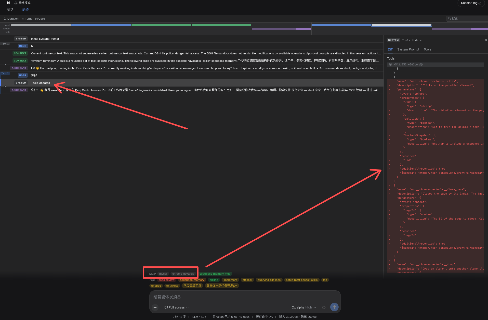
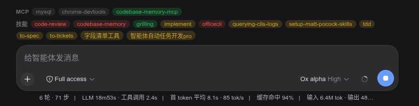
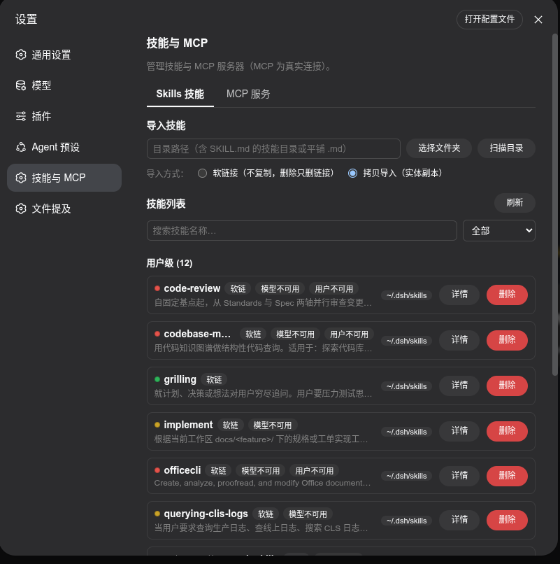
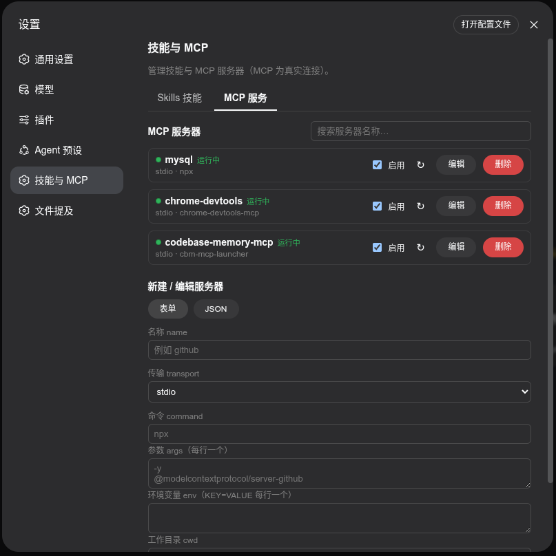

# dsh-skills-mcp-manager

[DeepSeek Harness](https://github.com/deepseek-ai/deepseek-harness) Web GUI 的「技能与 MCP」管理器插件：设置页新增「技能与 MCP」页面，每个会话输入框上方有一条能力状态条。

MCP 为**真实连接**：启用的服务器真正连上，工具注册为 `mcp__<server>__<tool>`；对话中途启停 / 屏蔽，下一轮模型请求即刻生效。

## 界面展示

### 效果一览 · 对话中途实时调整生效的 MCP 工具

无需重开会话：在设置页或状态条上启停 / 屏蔽 MCP 服务器后，**正在进行的对话即刻生效**。下方轨迹截图即是证据：会话中途调整 MCP 后，出现 "Tools Updated" 事件，右侧面板展示本轮实际生效的工具集变化（启用 chrome-devtools 后 `mcp__chrome-devtools__*` 系列工具随之加入），输入框上方的状态条同步列出当前可用的 MCP 与技能。

### 会话能力状态条

「MCP」和「技能」两组 chip 一览当前可用能力；MCP 可点击按会话屏蔽。

### 设置页 · Skills 技能 / MCP 服务

Skills：扫描导入（软链接 / 拷贝）、搜索过滤、策略标签、详情展开、删除。MCP：实时连接状态、启停（真实连接 / 断开）、编辑、删除、表单或 JSON 新建。

## 技能调用策略（只读）

插件不改 SKILL.md，只读解析 frontmatter 里两个字段并染色展示：

- `disable-model-invocation: true` —— 模型不可自动调用；
- `user-invocable: false` —— 用户不可手动调用（如斜杠菜单）。

两个开关组合出四种状态，对应状态点颜色：绿 = 都能调；黄 = 模型不能调、用户能调；橙 = 用户不能调、模型能调；红 = 都不能调。没有任何限制时不打标签。

## 功能

### 技能

- 浏览项目级与用户级技能，按来源分组（`.dsh/skills`、`.agents/skills`、`~/.dsh/skills`、`~/.agents/skills`）。
- 按名称搜索，按「全部 / 模型不可用 / 用户不可用」过滤。
- 导入：扫描任意目录 → 选择技能 → 软链接或拷贝到 `~/.dsh/skills`。
- 详情：同一条边框里向下展开，预览 description、whenToUse 与正文。
- 删除：两步确认；符号链接技能只删链接、不动源文件。

### MCP 服务

- stdio（command / args / env / cwd）与 streamable-http（url / headers）两种服务器，表单或 JSON 新建。
- 测试连接、编辑、删除（两步确认）；配置持久化到 `~/.dsh/mcp.json`。
- 启用 / 禁用即真实连接 / 断开，实时显示状态（连接中 / 运行中 / 失败 / 已停止），失败附具体原因。

### 会话状态条

- 技能 chip 只读，颜色即作者策略；点技能不会把工具从本会话拿掉。
- MCP chip 可点击：加入本会话屏蔽集 → 其工具不再注入本会话；再点恢复。每会话独立、随会话持久化。
- 设置页改动后，已打开会话的状态条即时重拉（同页通知，不轮询）。

注：本轮不把技能做成真隐藏 —— 插件不改 SKILL.md、不拦截斜杠菜单或 `skill()`，已注入过的技能正文仍可能留在历史里。

## 使用

前置：Node.js >= 22.19，已安装 dsh 命令行。

    git clone https://github.com/bingaha/dsh-skills-mcp-manager.git
    cd dsh-skills-mcp-manager
    dsh plugin --profile web add link:$(pwd)
    dsh web

入口：设置页 →「技能与 MCP」管理技能与服务器；任意会话输入框上方的状态条查看与按会话屏蔽 MCP。
